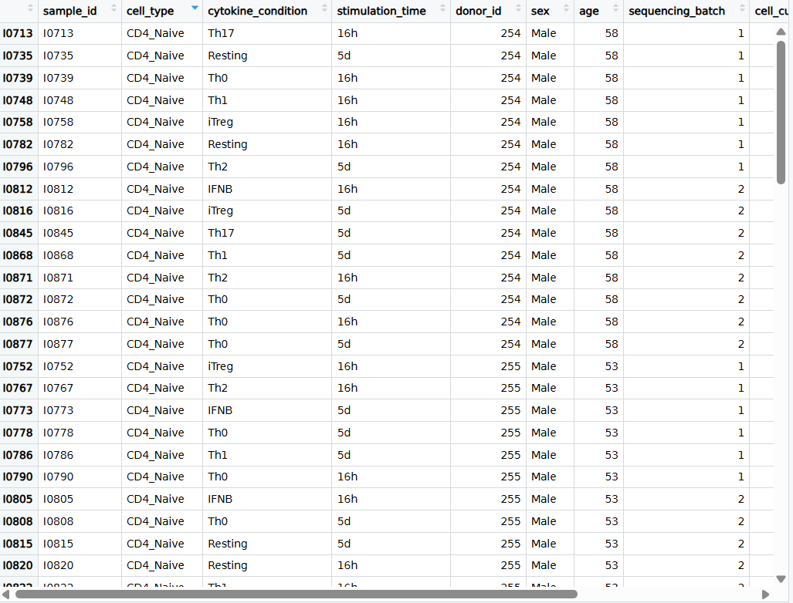
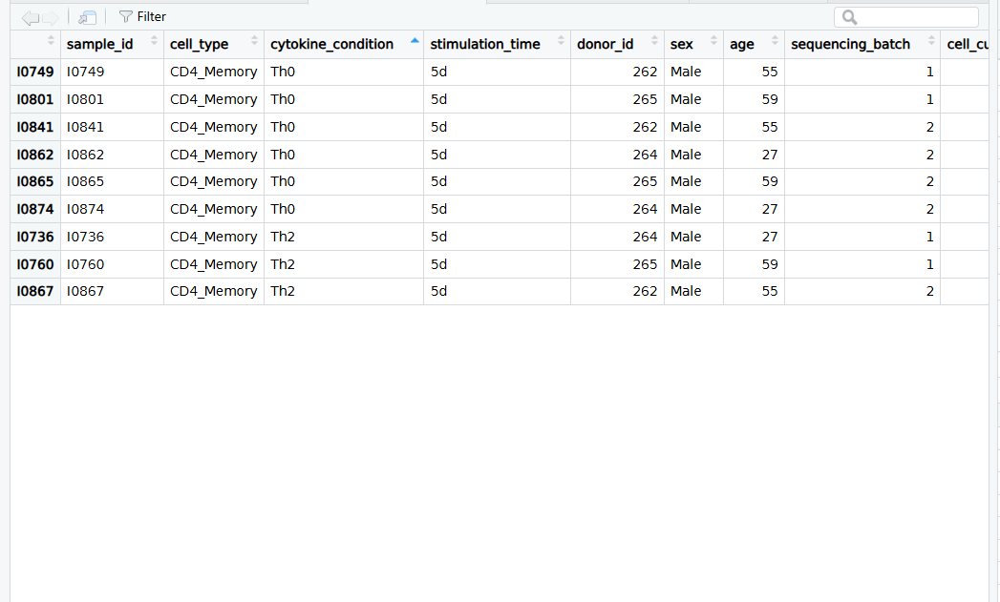
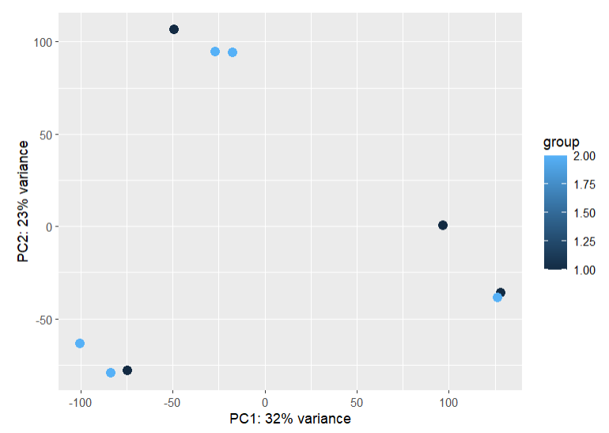
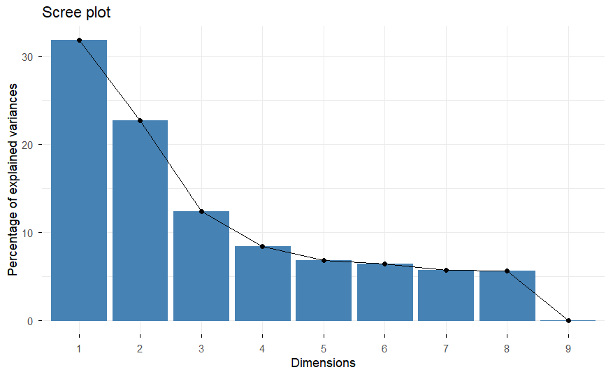
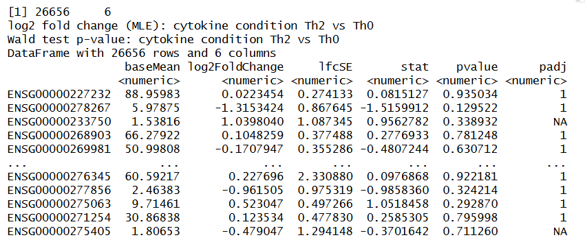
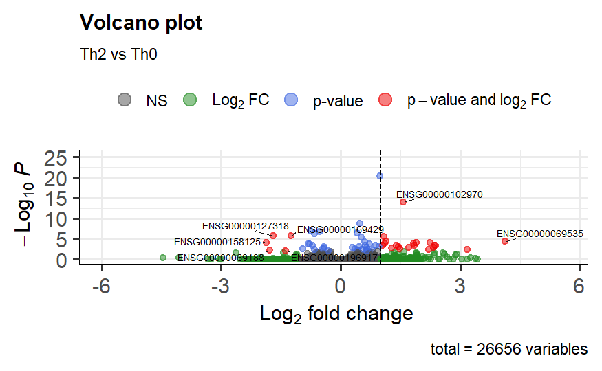
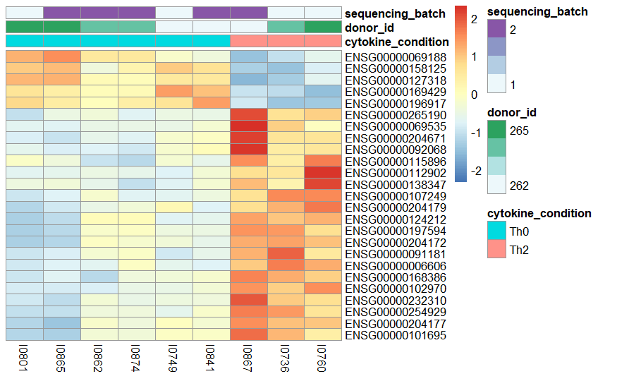

# Differential-Gene-Expression-Analysis
Differential Gene Expression Analysis of Bulk and Single Cell RNA Data Using R and Python

- Analysed and identified cytokine-driven distinct Th0 vs Th2 gene expression in Naive CD4+ T cells and Memory CD4+ T cells in a paper published by Cano-Gamez et al, 2020.
- Used DESeq2 in R for bulk RNA-seq data analysis and annData and ScyPy in Python for single cell RNA Seq data analysis.

## Bulk RNA-Seq data analysis using R

## Single cell RNA-Seq data analysis using Python
